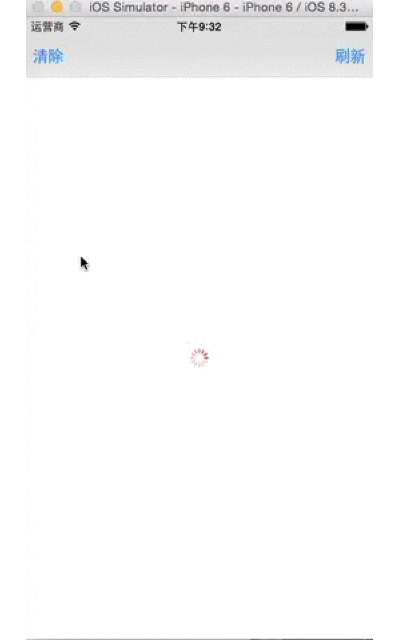

# BYStateScrollView_Swift
==============

Easy to showing some empty state view for UITableView/UICollectionView

Refer to this article : [DZNEmptyDataSet](https://github.com/dzenbot/DZNEmptyDataSet)


## Screenshot




## Usage 

Conform to datasource

```swift
override func viewDidLoad() {
	super.viewDidLoad()
	tableView.tableFooterView = UIView()
	tableView.byStateDataSource = self
}
```

DataSource implementation

```swift
///The attributed string for the title 
func byStateTitleAttributedText( scrollView : UIScrollView ) -> NSAttributedString?{
}
///The attributed string for the detail
func byStateDetailAttributedText( scrollView : UIScrollView ) -> NSAttributedString?{
}
///The image for the imageView 
func byStateImage( scrollView : UIScrollView ) -> UIImage?{
}
///The button attributed string for the specified button 
func byStateButtonAttributedText( scrollView : UIScrollView , forState : UIControlState) -> NSAttributedString?{
}
///The colo for the loading state view color 
func byStateLoaddingColor (scrollView : UIScrollView ) -> UIColor?{
}
///The action for the button tapped action 
func byStateAction (scrollView : UIScrollView ){
}
```

Set `byState` ( `.Default` ,`.Loading`,`.Event`)

* `.Loading` : showing loading view ( tableView/collectionView items is empty)
* `.Event` : showing empty view   ( tableView/collectionView items is empty)

You also can use `reloadBYStateView` method to reload tableView/collectonView

## Communication

- Found a bug or have a feature request? [Open an issue](https://github.com/sgxiang/YTKKeyValueStore_Swift/issues).

- Want to contribute? [Submit a pull request](https://github.com/sgxiang/YTKKeyValueStore_Swift/pulls).

## Author

- [sgxiang](https://twitter.com/sgxiang1992)
